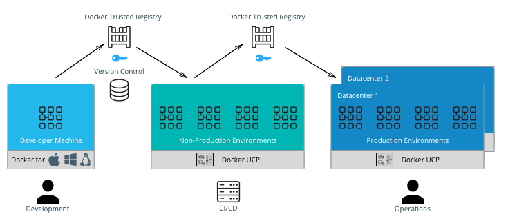

# Preliminary Answers

## I'm not a developer, why should I use git?

Are you sure you're not a developer? This argument rages often, but as far as git
is concerned, even if you aren't developing modules, even if you just have a
collection of scripts in a folder, that's still source code and git can help you.

## It just makes my workflow harder.

Any tool that you don't know yet is going to feel this way. Any new tool will
introduce some measure of complexity into your work day. Just like IIS did or
like SQLServer or Sharepoint did. But you accept that complexity because the cost
of learning those tools drove benefit for you or for someone else that you support.

In the case of git, there is of course some additional complexity it will add to
your workflow, I won't try to convince you there isn't, but hopefully I can
convince you that the tradeoff is worth it.

## We're just a small team.

It's just me and a couple others. Why do I need source control?

Because source control is also about working more efficiently on your own.
During your own workflow, are you always commenting in the code why you made
each individual change? Do you note the date and time you make changes to each
line? Git can give you a reliable time line of your scripts evolution, and do it
in a way that gives you backup and lets other people see that history.

## Git has eaten the devops world.

Devops tools are usually tightly linked to source control and git practices.
Continuous integration and delivery often begin with and are interwoven at
multiple steps along the way, with git.

https://success.docker.com/article/dev-pipeline

Even if you're not thinking about it in terms of devops tools; let's say you
don't mess around with any of this Jenkins Pipelines, CI/CD, fancy stuff, my
guess is that if you're at this conference, you're probably interested in
writing PowerShell modules right?

http://ramblingcookiemonster.github.io/Building-A-PowerShell-Module/

